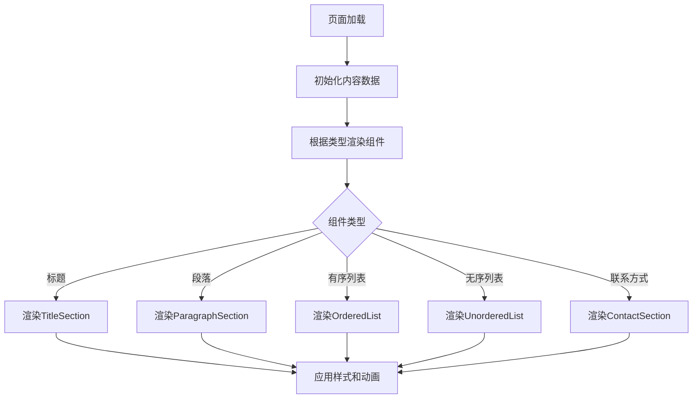

# 数据模型设计

## 概述

投稿须知界面优化主要涉及内容展示结构的设计，不涉及复杂的数据存储或状态管理。重点在于将原本的纯文本内容转换为结构化的、可视化的内容组件。

## 内容结构定义

### 页面内容实体 (PageContent)

**内容层次结构：**
```javascript
{
  title: "投稿须知",
  sections: [
    {
      type: "paragraph",
      content: "欢迎您参与血染钟楼剧本创作！"
    },
    {
      type: "paragraph",
      content: "为了确保社区内容的质量和版权合规性，请遵守以下投稿要求："
    },
    {
      type: "ordered-list",
      title: "投稿要求",
      items: [
        "剧本必须为原创作品，不得侵犯他人版权",
        "内容应积极健康，符合社区价值观",
        "包含完整的游戏规则和角色设定",
        "建议提供剧本相关图片（可选）"
      ]
    },
    {
      type: "unordered-list",
      title: "投稿格式要求",
      items: [
        "使用标准JSON格式",
        "包含标题、作者、版本等基本信息",
        "详细描述角色能力和游戏规则"
      ]
    },
    {
      type: "ordered-list",
      title: "审核流程",
      items: [
        "提交后3-5个工作日内完成审核",
        "通过审核的剧本将公开展示",
        "不符合要求的将收到修改建议"
      ]
    },
    {
      type: "contact",
      title: "投稿邮箱",
      content: "contact@example.com"
    }
  ]
}
```

### 内容组件类型

#### 1. TitleSection (标题组件)
**属性：**
- `text`: 字符串，标题文字
- `level`: 数字，标题层级 (1-3)

**样式特征：**
- 字体大小：32rpx-28rpx（根据层级）
- 字体粗细：bold
- 颜色：#333
- 上下边距：24rpx

#### 2. ParagraphSection (段落组件)
**属性：**
- `text`: 字符串，段落内容
- `emphasis`: 布尔值，是否强调显示

**样式特征：**
- 字体大小：28rpx
- 行高：1.6
- 颜色：#555（普通）/#333（强调）
- 上下边距：16rpx
- 文本对齐：justify

#### 3. OrderedList (有序列表组件)
**属性：**
- `title`: 字符串，列表标题
- `items`: 数组，列表项数组

**样式特征：**
- 列表项前缀：数字编号（1. 2. 3.）
- 左边距：40rpx
- 列表项间距：12rpx
- 字体大小：28rpx

#### 4. UnorderedList (无序列表组件)
**属性：**
- `title`: 字符串，列表标题
- `items`: 数组，列表项数组

**样式特征：**
- 列表项前缀：圆点（•）
- 左边距：40rpx
- 列表项间距：12rpx
- 字体大小：28rpx

#### 5. ContactSection (联系方式组件)
**属性：**
- `title`: 字符串，联系方式标题
- `content`: 字符串，联系信息
- `type`: 字符串，联系类型（email/phone等）

**样式特征：**
- 标题样式：中等粗细，#333
- 内容样式：品牌色，链接样式
- 特殊处理：可点击复制

## 状态管理

### 组件状态
**加载状态：**
- `loading`: 布尔值，内容加载状态
- `error`: 字符串，错误信息

**交互状态：**
- `expanded`: 布尔值，某些部分是否展开（预留）
- `selectedItem`: 数字，选中的列表项（预留）

### 响应式设计状态
**屏幕尺寸：**
- `screenWidth`: 数字，屏幕宽度
- `isSmallScreen`: 布尔值，是否小屏幕设备

## 数据流设计

### 内容渲染流程



### 样式应用流程

1. **基础样式**: 应用组件基础样式类
2. **主题样式**: 根据主题应用颜色和字体
3. **响应式样式**: 根据屏幕尺寸调整布局
4. **动画样式**: 应用进入动画效果

## 验证规则

### 内容完整性验证
- [ ] 所有必需字段存在且不为空
- [ ] 列表项数组不为空
- [ ] 组件类型在允许范围内

### 样式一致性验证
- [ ] 所有组件使用统一的颜色规范
- [ ] 字体大小符合层级规范
- [ ] 间距符合设计规范

### 性能验证
- [ ] 渲染时间 < 500ms
- [ ] 内存占用合理
- [ ] 动画流畅度 > 60fps

## 扩展性设计

### 新组件支持
预留组件类型扩展机制：
- 新增组件类型时，只需添加对应的渲染逻辑
- 样式系统支持动态扩展
- 保持向后兼容性

### 国际化支持
内容结构支持多语言：
- 文本内容可外部化
- 组件布局保持一致
- 字体和样式适配不同语言特性

### 无障碍访问
- 语义化HTML结构（在小程序允许范围内）
- 足够的颜色对比度
- 支持屏幕阅读器（预留）